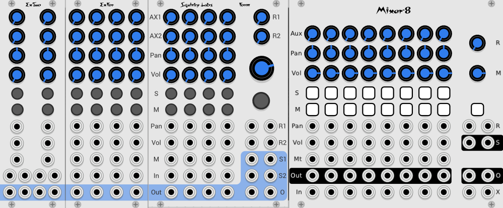
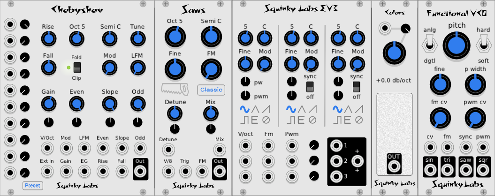
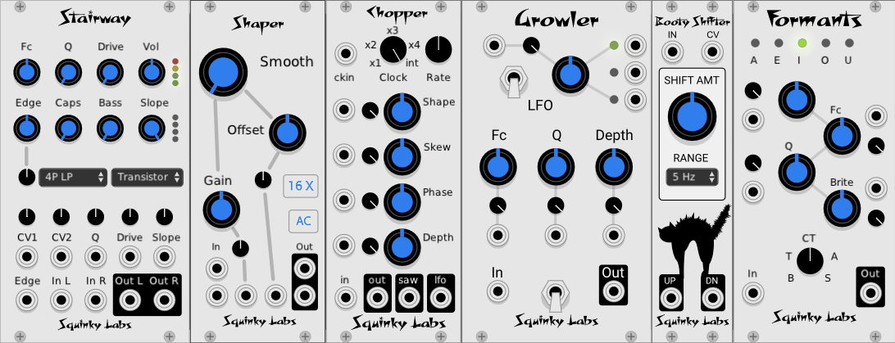
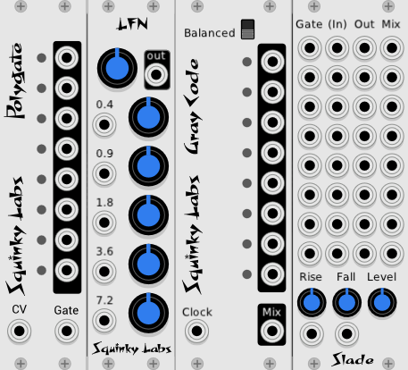

# The Squinky Labs modules for VCV Rack

Below are short descriptions of our modules with links to more detailed manuals.

At the end of the description of each module there is a link the the documentation for that module. There is much more information there, so be sure to click on the links of modules you are interested in.

The [Changelog](../CHANGELOG.md) describes recent changes to our modules.

# Seq++

[Seq++](./sq2.md) is a polyphonic sequencer that provides "DAW-like" music editing in a VCV module. May be used for composing "traditional" music, for triggering patch changes from a timeline, and many other uses.

# Mixers

[Form](./form.md) is a modular mixer with a ton of features. Channels are added by placing ExFor modules to the right of it. It has two stereo send busses, and anti-pop filters on all CV inputs.

[ExFor](./exfor.md) is the an expander for Form. Each instance of ExFor adds four more channels.

[ExTwo](.extwo.md) is the newest expander for Form. Each instance adds two stereo channels.

[Mixer-8](./mix8.md) is our clone of the AS 8-CH mixer, with more features and 1/10 the CPU usage.

# Things that make sound

[EV3](./ev3.md) is three VCOs in a single module. Each of the three VCOs is a clone of Befaco's EvenVCO, with oscillator sync added. Like EvenVCO, it sounds good, uses little CPU, and has very little aliasing distortion.

[Chebyshev Waveshaper VCO](../docs/chebyshev.md) can make sounds like no other VCO. It contains a VCO, ten polynomial wave-shapers, and one clipper/folder. Among other things, it is a **harmonic oscillator**.

[Saws](./saws.md) is an emulation of the legendary Roland Super-Saw from the JP-8000.

[Colors](./colors.md) is a colored noise generator. It can generate all the common **"colors"** of noise, including white, pink, red, blue, and violet. And all the colors in between.

[Functional VCO-1](./functional-vco-1.md) [deprecated] is an improved version of the Fundamental VCO-1 version 0.6. Now that Fundamental VCO-1 1.0 is so much improved, there is no reason to use Functional VCO-1.

# Things that process sound

[Stairway](./filter.md). Ladder filter with an enormous range of over-driven and clean sounds. Combines features from Moog, Oberheim, and Rossum filters and adds some some of our own, including four independent wave shapers.

[Shaper](./shaper.md). Yet another wave shaper. But unlike most, this one has almost no aliasing distortion. And a few new shapes that sound nice.

[Chopper](./chopper.md) Is a tremolo powered by a clock-synchable LFO. The LFO is highly programmable to give a range of waveforms. A built-in clock multiplier enables easy rhythmic effects.

[Growler](./growler.md) is a "vocal animator." It imparts random vocal timbres on anything played through it. The pseudo-random LFOs all have discrete outputs.

[Booty Shifter](./shifter.md). An emulation of the legendary Moog/Bode frequency shifter. It is great for "warping" sounds run through it.

[Formants](./formants.md) is a programmable bank of filters that can synthesize various vowel sounds and morph between them easily.

# Other things

[Polygate](./polygate.md) is an eight channel get generator. It takes polyphonic CV and Gate as inputs, and outputs eight mono gate signals. Design for triggering drums from a polyphonic sequencer, it also has many less obvious uses.

[Slade](./slew4.md) has eight identical channels of lag/anti-pop/envelope generator/VCA. Very low CPU, as always.

[Gray Code](./gray-code.md). Think of it as a semi-random clock divider. Or not. Gray codes have the cool property that only one bit changes at a time. Having only one "thing" change at a time can be interesting for music, so we are hoping you will find some good things to do with it.

[LFN](./lfn.md) is a random voltage generator made by running low frequency noise through a graphic equalizer. The equalizer gives a lot of easy control over the shape of the randomness.

# More resources

Here is a video by Dave Phillips that uses a lot of EV3 VCOs, and some other Squinky Labs modules: [A Machine Dream](https://www.youtube.com/watch?v=c2fzgobYjbk).

Omri Cohen has this [Chebyshev tutorial](https://www.youtube.com/watch?v=cv4N_6qRAK8&t=549s)

Artem Leonov has [7 REASONS to use a Tremolo in Modular Environment](https://www.youtube.com/watch?v=UYeEKPMYDoA)
